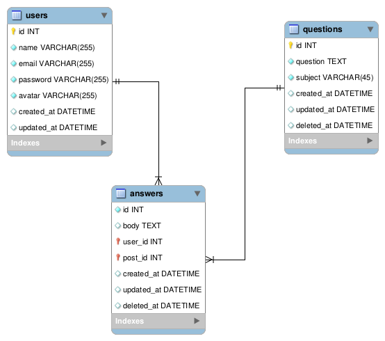

# Forumi Backend

## Tech Stack
- NodeJS v14.*
- ExpressJS
- MySQL 8.0
- Sequelize ORM
- Joi Validation

## DB Design


## Installation
- Clone the repository
- Install NodeJS v14.* and make sure to use yarn
- Copy .env.example to .env and fill in the values
- Install module
```angular2html
yarn install
```
- Run the server (development mode)
```angular2html
yarn run dev
```
